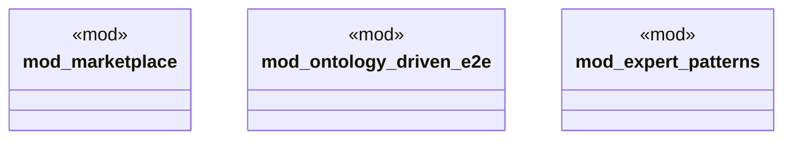

# `tests/chicago_tdd/mod.rs`

Source SHA-256: `7caf1cc0af8d2139caab8add5472f25a9217a20b382f676408e9645bb08fe76e`

## Dependencies

- None observed.

## Standing

- Structural parse: `ALIVE`
- Runtime behavior: `UNKNOWN`
