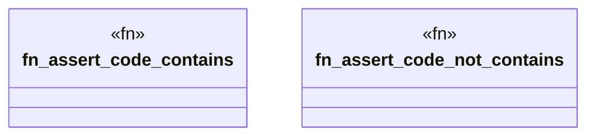

# `tests/chicago_tdd/ontology_driven_e2e.rs`

Source SHA-256: `ddc0e3790eb4de276a4cfec76a3ab011fa462039a49b0ca8eb7b87828a13bdcd`

## Dependencies

- `anyhow::Result`
- `ggen_core::Graph`
- `ggen_core::domain::graph::{execute_query, QueryInput}`
- `ggen_core::domain::template::render_with_rdf::{render_with_rdf, RenderWithRdfOptions}`
- `std::fs`
- `std::path::PathBuf`
- `tempfile::TempDir`

## Standing

- Structural parse: `ALIVE`
- Runtime behavior: `UNKNOWN`
