# `tests/chicago_tdd/utils/audit_security_tests.rs`

Source SHA-256: `1c0908bad1af771e628a9fd06cdad72b0cf2c47dbb632d9d6a8846afd09ab4d4`

```mermaid
classDiagram
    class fn_test_severity_levels_ordering {
      <<fn>>
    }
    class fn_test_severity_summary_calculations {
      <<fn>>
    }
    class fn_test_config_auditor_detects_secrets {
      <<fn>>
    }
    class fn_test_config_auditor_clean_config {
      <<fn>>
    }
    class fn_test_config_auditor_nonexistent_file {
      <<fn>>
    }
    class fn_test_config_auditor_default_file {
      <<fn>>
    }
    class fn_test_workflow_status_parsing {
      <<fn>>
    }
    class fn_test_config_issue_creation {
      <<fn>>
    }
    class fn_test_vulnerability_structure {
      <<fn>>
    }
    class fn_test_vulnerable_dependency_structure {
      <<fn>>
    }
    class fn_test_security_scan_result_structure {
      <<fn>>
    }
    class fn_test_all_config_issue_types {
      <<fn>>
    }
    class fn_test_config_auditor_measures_duration {
      <<fn>>
    }
```

## Dependencies

- `ggen_cli::domain::audit::security::*`
- `ggen_cli::domain::ci::workflow::WorkflowStatus`
- `std::path::PathBuf`
- `tempfile::TempDir`

## Standing

- Structural parse: `ALIVE`
- Runtime behavior: `UNKNOWN`
