# `tests/chicago_tdd/utils/ci_workflow_tests.rs`

Source SHA-256: `e6beb8be1180d34303abf65174c0cb0c7fc4f5a5c8da92c4d910f832257f914e`

```mermaid
classDiagram
    class fn_test_workflow_status_from_string {
      <<fn>>
    }
    class fn_test_workflow_status_to_string {
      <<fn>>
    }
    class fn_test_workflow_status_round_trip {
      <<fn>>
    }
    class fn_test_workflow_status_is_active {
      <<fn>>
    }
    class fn_test_workflow_info_structure {
      <<fn>>
    }
    class fn_test_job_info_structure {
      <<fn>>
    }
    class fn_test_workflow_list_result {
      <<fn>>
    }
    class fn_test_workflow_status_result {
      <<fn>>
    }
    class fn_test_workflow_logs_result {
      <<fn>>
    }
    class fn_test_workflow_status_equality {
      <<fn>>
    }
    class fn_test_multiple_workflow_filtering {
      <<fn>>
    }
    class fn_test_job_info_optional_fields {
      <<fn>>
    }
```

## Dependencies

- `ggen_cli::domain::ci::workflow::*`

## Standing

- Structural parse: `ALIVE`
- Runtime behavior: `UNKNOWN`
