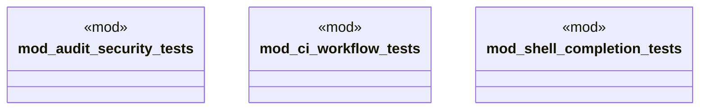

# `tests/chicago_tdd/utils/mod.rs`

Source SHA-256: `2143939d340dc2541ce01d012dd1817fbf632183b5759e710d64f558e735fc6e`

## Dependencies

- None observed.

## Standing

- Structural parse: `ALIVE`
- Runtime behavior: `UNKNOWN`
