# `tests/chicago_tdd/utils/shell_completion_tests.rs`

Source SHA-256: `ab5a12c5423ef889558c5ea00baf1a702e4232a2c209e8ba53063a9d616aa12f`

```mermaid
classDiagram
    class fn_test_shell_type_parsing {
      <<fn>>
    }
    class fn_test_shell_type_round_trip {
      <<fn>>
    }
    class fn_test_completion_generator_produces_valid_scripts {
      <<fn>>
    }
    class fn_test_file_system_installer_creates_files {
      <<fn>>
    }
    class fn_test_file_system_installer_respects_force_flag {
      <<fn>>
    }
    class fn_test_system_shell_lister_detects_installed_shells {
      <<fn>>
    }
    class fn_test_shell_default_completion_dirs {
      <<fn>>
    }
    class fn_test_completion_script_contains_commands {
      <<fn>>
    }
    class fn_test_installer_creates_parent_directories {
      <<fn>>
    }
    class fn_test_completion_scripts_are_non_empty_and_valid_utf8 {
      <<fn>>
    }
    class fn_test_multiple_installations_with_force {
      <<fn>>
    }
```

## Dependencies

- `ggen_cli::domain::shell::completion::*`
- `std::path::PathBuf`
- `tempfile::TempDir`

## Standing

- Structural parse: `ALIVE`
- Runtime behavior: `UNKNOWN`
