# `tests/ci_validate.rs`

Source SHA-256: `ef59ba5014857af4c7acea31c4224649a8d27d6c2321c5674abae3c664073478`

```mermaid
classDiagram
    class fn_test_ci_validate_requires_workflow_or_all {
      <<fn>>
    }
    class fn_test_ci_validate_single_workflow_not_found {
      <<fn>>
    }
    class fn_test_ci_validate_all_no_workflows_directory {
      <<fn>>
    }
    class fn_test_ci_validate_valid_yaml_workflow {
      <<fn>>
    }
    class fn_test_ci_validate_invalid_yaml {
      <<fn>>
    }
    class fn_test_ci_validate_all_workflows {
      <<fn>>
    }
    class fn_test_ci_validate_with_verbose {
      <<fn>>
    }
    class fn_test_ci_validate_with_security {
      <<fn>>
    }
```

## Dependencies

- `assert_cmd::Command`
- `assert_fs::prelude::*`
- `predicates::prelude::*`

## Standing

- Structural parse: `ALIVE`
- Runtime behavior: `UNKNOWN`
