# `tests/cli.rs`

Source SHA-256: `6b988643def2690ff90d9fd33457f88ea1a9706e5d87f5b500125579f3f1ec6f`

```mermaid
classDiagram
    class struct_EnvVarGuard {
      <<struct>>
      +"key: &'static str"
      +"previous: Option~std::ffi::OsString~"
    }
    class fn_test_cli_basic {
      <<fn>>
    }
    class fn_test_version {
      <<fn>>
    }
    class fn_test_hazard_exit_code {
      <<fn>>
    }
    class fn_test_hazard_stdout {
      <<fn>>
    }
    class fn_test_cli_help_commands {
      <<fn>>
    }
    class fn_test_search_command_basic_usage {
      <<fn>>
    }
    class fn_test_search_command_with_filters {
      <<fn>>
    }
    class fn_test_cli_error_handling {
      <<fn>>
    }
    class fn_test_cli_output_formats {
      <<fn>>
    }
    class fn_test_cli_environment_variables {
      <<fn>>
    }
    note "Drop for EnvVarGuard"
    note "EnvVarGuard"
```

## Dependencies

- `assert_cmd::Command`
- `predicates::prelude::*`
- `serial_test::serial`

## Standing

- Structural parse: `ALIVE`
- Runtime behavior: `UNKNOWN`
