# `tests/cli/project/gen_test.rs`

Source SHA-256: `33b724705a3720ad6784711b7b34580a8416713da0fe7089ddb0529363389339`

```mermaid
classDiagram
    class fn_test_gen_requires_template_ref {
      <<fn>>
    }
    class fn_test_gen_validates_empty_template_ref {
      <<fn>>
    }
    class fn_test_gen_parses_variables {
      <<fn>>
    }
    class fn_test_gen_rejects_invalid_variable_format {
      <<fn>>
    }
    class fn_test_gen_dry_run_flag {
      <<fn>>
    }
    class fn_test_gen_force_flag {
      <<fn>>
    }
    class fn_test_gen_seed_for_determinism {
      <<fn>>
    }
    class mod_unit_tests {
      <<mod>>
    }
```

## Dependencies

- `assert_cmd::Command`
- `ggen_cli_lib::cmds::project::gen::GenArgs`
- `predicates::prelude::*`
- `tempfile::TempDir`

## Standing

- Structural parse: `ALIVE`
- Runtime behavior: `UNKNOWN`
