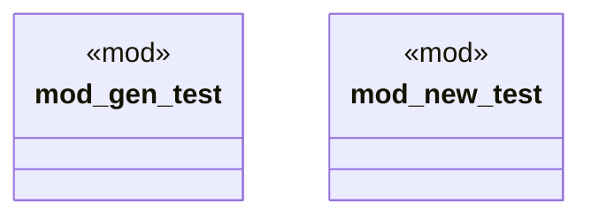

# `tests/cli/project/mod.rs`

Source SHA-256: `50ff69d2ca397492a635dd351af6395a96ae7582d45b912bd242ebdc4f10137f`

## Dependencies

- None observed.

## Standing

- Structural parse: `ALIVE`
- Runtime behavior: `UNKNOWN`
