# `tests/cli/project/new_test.rs`

Source SHA-256: `958eb64b4761b7c728dfe9362c1e6958df576da7928056e7685ddb3771b4e1d7`

```mermaid
classDiagram
    class fn_test_new_requires_name {
      <<fn>>
    }
    class fn_test_new_requires_type {
      <<fn>>
    }
    class fn_test_new_validates_project_name_no_spaces {
      <<fn>>
    }
    class fn_test_new_validates_project_type {
      <<fn>>
    }
    class fn_test_new_rust_cli_project_basic {
      <<fn>>
    }
    class fn_test_new_with_framework {
      <<fn>>
    }
    class fn_test_new_skip_install_flag {
      <<fn>>
    }
    class mod_unit_tests {
      <<mod>>
    }
```

## Dependencies

- `assert_cmd::Command`
- `ggen_cli_lib::cmds::project::new::{NewArgs, run}`
- `predicates::prelude::*`
- `std::path::PathBuf`
- `super::*`
- `tempfile::TempDir`

## Standing

- Structural parse: `ALIVE`
- Runtime behavior: `UNKNOWN`
