# `tests/cli_command_tests.rs`

Source SHA-256: `03135817312ca051d7979be6067b317de2072614ebd7a9807955844fb211f245`

```mermaid
classDiagram
    class type_TestResult {
      <<type>>
    }
    class fn_test_help_command {
      <<fn>>
    }
    class fn_test_version_command {
      <<fn>>
    }
    class fn_test_help_short_flag {
      <<fn>>
    }
    class fn_test_version_short_flag {
      <<fn>>
    }
    class fn_test_no_args_shows_help {
      <<fn>>
    }
    class fn_test_init_requires_name {
      <<fn>>
    }
    class fn_test_init_with_name {
      <<fn>>
    }
    class fn_test_init_creates_config_file {
      <<fn>>
    }
    class fn_test_init_with_template_flag {
      <<fn>>
    }
    class fn_test_init_duplicate_project_fails {
      <<fn>>
    }
    class fn_test_generate_requires_template {
      <<fn>>
    }
    class fn_test_generate_with_template_name {
      <<fn>>
    }
    class fn_test_generate_output_flag {
      <<fn>>
    }
    class fn_test_generate_vars_flag {
      <<fn>>
    }
    class fn_test_generate_force_flag {
      <<fn>>
    }
    class fn_test_invalid_config_format {
      <<fn>>
    }
    class fn_test_missing_required_field {
      <<fn>>
    }
    class fn_test_valid_config_passes {
      <<fn>>
    }
    class fn_test_config_with_dependencies {
      <<fn>>
    }
    class fn_test_workspace_config_validation {
      <<fn>>
    }
    class fn_test_unknown_command_fails {
      <<fn>>
    }
    class fn_test_invalid_flag_fails {
      <<fn>>
    }
    class fn_test_conflicting_flags_fails {
      <<fn>>
    }
    class fn_test_missing_required_arg {
      <<fn>>
    }
    class fn_test_error_message_clarity {
      <<fn>>
    }
```

## Dependencies

- `assert_cmd::Command`
- `predicates::prelude::*`

## Standing

- Structural parse: `ALIVE`
- Runtime behavior: `UNKNOWN`
