# `tests/common/fixtures.rs`

Source SHA-256: `a7920acb9bdb033789cf78c4deae3f706a725934141a6a2a747ed024b3b7e7c5`

```mermaid
classDiagram
    class fn_sample_phase_init {
      <<fn>>
    }
    class fn_sample_phase_build {
      <<fn>>
    }
    class fn_sample_phase_test {
      <<fn>>
    }
    class fn_sample_make {
      <<fn>>
    }
    class fn_sample_context {
      <<fn>>
    }
    class fn_sample_package {
      <<fn>>
    }
    class fn_create_temp_dir {
      <<fn>>
    }
    class fn_sample_template_vars {
      <<fn>>
    }
    class fn_sample_template_content {
      <<fn>>
    }
    class fn_sample_make_toml {
      <<fn>>
    }
    class fn_sample_gpack_manifest {
      <<fn>>
    }
    class fn_test_cache_path {
      <<fn>>
    }
```

## Dependencies

- `ggen_core::lifecycle::{Context, Make, Phase, PhaseBuilder, Project}`
- `std::collections::BTreeMap`
- `std::path::PathBuf`
- `std::sync::Arc`
- `tempfile::TempDir`

## Standing

- Structural parse: `ALIVE`
- Runtime behavior: `UNKNOWN`
