# `tests/common/helpers.rs`

Source SHA-256: `f5f42e32ad92514da573eda69ac76bb2bc69e660535bc246fd30bfbab7c3a3f8`

```mermaid
classDiagram
    class fn_write_file_in_temp {
      <<fn>>
    }
    class fn_read_file {
      <<fn>>
    }
    class fn_file_exists {
      <<fn>>
    }
    class fn_dir_exists {
      <<fn>>
    }
    class fn_create_test_structure {
      <<fn>>
    }
    class fn_assert_contains {
      <<fn>>
    }
    class fn_assert_file_contains {
      <<fn>>
    }
    class fn_mock_success_command {
      <<fn>>
    }
    class fn_mock_failure_command {
      <<fn>>
    }
    class fn_echo_command {
      <<fn>>
    }
    class fn_measure_time {
      <<fn>>
    }
    class fn_assert_time_bound {
      <<fn>>
    }
```

## Dependencies

- `std::fs`
- `std::path::Path`
- `tempfile::TempDir`

## Standing

- Structural parse: `ALIVE`
- Runtime behavior: `UNKNOWN`
