# `tests/common/mod.rs`

Source SHA-256: `de9391850fbb000d91467f090099b7183377797e6fe78a2a6a14d6d89f00d926`

```mermaid
classDiagram
    class mod_fixtures {
      <<mod>>
    }
    class mod_helpers {
      <<mod>>
    }
    class struct_TestConfig {
      <<struct>>
      +"unit_timeout_seconds: u64"
      +"integration_timeout_seconds: u64"
      +"default_test_cases: u32"
      +"container_wait_timeout_seconds: u64"
      +"http_connection_timeout_seconds: u64"
      +"default_http_port: u16"
      +"default_https_port: u16"
      +"default_http_alt_port: u16"
      +"concurrent_containers_count: usize"
      +"concurrent_commands_count: usize"
      +"multi_container_count: usize"
      +"commands_per_container: usize"
      +"hot_path_tick_budget: u64"
      +"max_run_len: usize"
      +"max_batch_size: usize"
    }
    class fn_load_config {
      <<fn>>
    }
    class fn_get_config {
      <<fn>>
    }
    class fn_unit_timeout {
      <<fn>>
    }
    class fn_integration_timeout {
      <<fn>>
    }
    class fn_property_test_cases {
      <<fn>>
    }
    class fn_container_wait_timeout {
      <<fn>>
    }
    class fn_http_connection_timeout {
      <<fn>>
    }
    class fn_default_http_port {
      <<fn>>
    }
    class fn_default_https_port {
      <<fn>>
    }
    class fn_default_http_alt_port {
      <<fn>>
    }
    class fn_concurrent_containers_count {
      <<fn>>
    }
    class fn_concurrent_commands_count {
      <<fn>>
    }
    class fn_multi_container_count {
      <<fn>>
    }
    class fn_commands_per_container {
      <<fn>>
    }
    class fn_hot_path_tick_budget {
      <<fn>>
    }
    class fn_max_run_len {
      <<fn>>
    }
    class fn_max_batch_size {
      <<fn>>
    }
    class fn_docker_available {
      <<fn>>
    }
    class fn_require_docker {
      <<fn>>
    }
    class mod_tests {
      <<mod>>
    }
    note "Default for TestConfig"
```

## Dependencies

- `fixtures::*`
- `helpers::*`
- `std::process::Command`
- `std::sync::OnceLock`
- `std::time::Duration`
- `super::*`

## Standing

- Structural parse: `ALIVE`
- Runtime behavior: `UNKNOWN`
