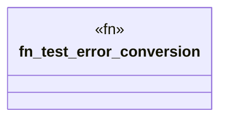

# `tests/config_error_conversion_tests.rs`

Source SHA-256: `55e063d98174d7748288bd7573dda4dfb8773f01263754069f88f1e7d8011962`

## Dependencies

- `ggen_config::domain::error::{A2aError, AgentError, McpError}`

## Standing

- Structural parse: `ALIVE`
- Runtime behavior: `UNKNOWN`
