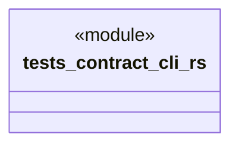

# `tests/contract/cli.rs`

Source SHA-256: `194ef988eaaa0be548433a9cfb03c0b5b9834162d9e1c739092400e77c579f9b`

## Dependencies

- `ggen_cli_lib::run_for_node`

## Standing

- Structural parse: `ALIVE`
- Runtime behavior: `UNKNOWN`
