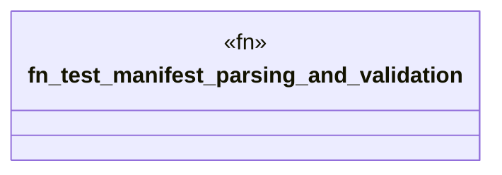

# `tests/contract/manifest.rs`

Source SHA-256: `cee74f8a9751c249af5f476d7bb56bbeb9b9cb45f05b843613a6474a6297e357`

## Dependencies

- `ggen_marketplace::packs_registry::types::PackFile`

## Standing

- Structural parse: `ALIVE`
- Runtime behavior: `UNKNOWN`
