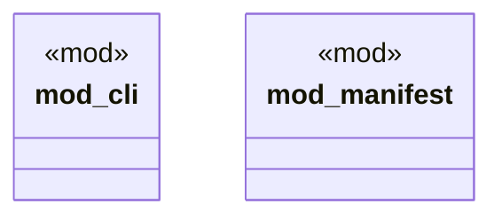

# `tests/contract/mod.rs`

Source SHA-256: `8458e5cdff409127a812e6b4d0f61a1a8322754ac4f523c357ef58693df07365`

## Dependencies

- None observed.

## Standing

- Structural parse: `ALIVE`
- Runtime behavior: `UNKNOWN`
