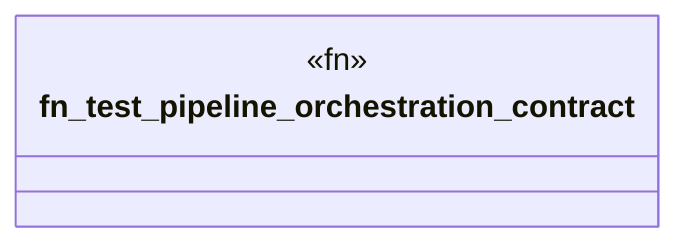

# `tests/contract/pipeline.rs`

Source SHA-256: `8ec7e0f547976f2aad130ff202297c9bccc7363c639eb1f9933ea4c2b10699e4`

## Dependencies

- `ggen_core::pipeline_engine::pipeline::{PipelineConfig, StagedPipeline}`

## Standing

- Structural parse: `ALIVE`
- Runtime behavior: `UNKNOWN`
