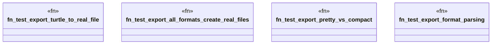

# `tests/domain/graph/export_tests.rs`

Source SHA-256: `7e578c4cc0903209e3367b4b51b41f286bd1c0f625a575f383a1e7cfa3deb3bd`

## Dependencies

- `anyhow::Result`
- `ggen_cli::domain::graph::{export_graph, ExportFormat, ExportOptions}`
- `std::fs`
- `tempfile::tempdir`

## Standing

- Structural parse: `ALIVE`
- Runtime behavior: `UNKNOWN`
