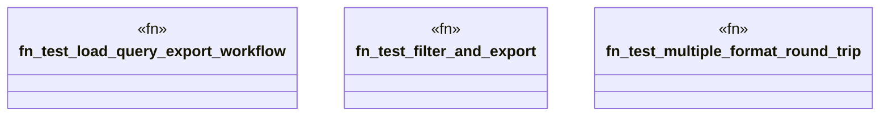

# `tests/domain/graph/integration_tests.rs`

Source SHA-256: `98ab13146daf0073d17221452c586fac00772f1b14eadb3193e410c8c1848d84`

## Dependencies

- `anyhow::Result`
- `ggen_cli::domain::graph::{ execute_sparql, export_graph, load_rdf, ExportFormat, ExportOptions, LoadOptions, QueryOptions, RdfFormat, }`
- `std::fs`
- `std::io::Write`
- `tempfile::{tempdir, NamedTempFile}`

## Standing

- Structural parse: `ALIVE`
- Runtime behavior: `UNKNOWN`
