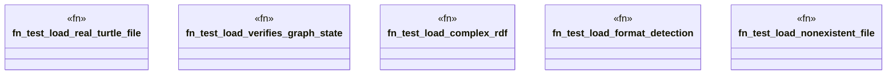

# `tests/domain/graph/load_tests.rs`

Source SHA-256: `d7db4594e4ff34a750f107a1b00b6b67ad220f5d7fc4242e067ac84e764139d4`

## Dependencies

- `anyhow::Result`
- `ggen_cli::domain::graph::{load_rdf, LoadOptions, RdfFormat}`
- `std::io::Write`
- `tempfile::NamedTempFile`

## Standing

- Structural parse: `ALIVE`
- Runtime behavior: `UNKNOWN`
