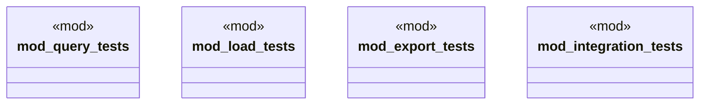

# `tests/domain/graph/mod.rs`

Source SHA-256: `cece4c416319c3729f6c96e0c5eaca7ff50e4c3e8cb1c5318531e927c2acacc2`

## Dependencies

- None observed.

## Standing

- Structural parse: `ALIVE`
- Runtime behavior: `UNKNOWN`
