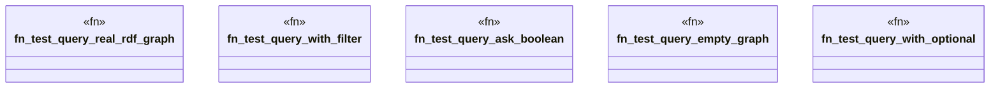

# `tests/domain/graph/query_tests.rs`

Source SHA-256: `730eea454a5aaadf2b0aebb9407abab16f7aafa3b3f3bc09d2a8b3351caf4afa`

## Dependencies

- `anyhow::Result`
- `ggen_cli::domain::graph::{execute_sparql, QueryOptions}`
- `ggen_core::Graph`
- `std::io::Write`
- `tempfile::NamedTempFile`

## Standing

- Structural parse: `ALIVE`
- Runtime behavior: `UNKNOWN`
