# `tests/e2e_github_integration.rs`

Source SHA-256: `fe530d69eeb85fe9626c78259c3846a677c62e494a00aa6e0cc2dfea0e7da433`

```mermaid
classDiagram
    class struct_EnvVarGuard {
      <<struct>>
      +"key: &'static str"
      +"previous: Option~std::ffi::OsString~"
    }
    class fn_test_github_pages_status_command {
      <<fn>>
    }
    class fn_test_github_pages_status_with_explicit_repo {
      <<fn>>
    }
    class fn_test_github_workflow_status_command {
      <<fn>>
    }
    class fn_test_github_workflow_status_with_workflow_name {
      <<fn>>
    }
    class fn_test_github_trigger_workflow_command {
      <<fn>>
    }
    class fn_test_github_repo_auto_detection {
      <<fn>>
    }
    class fn_test_github_commands_handle_missing_token {
      <<fn>>
    }
    class fn_test_github_pages_status_output_format {
      <<fn>>
    }
    class fn_test_github_workflow_status_lists_workflows {
      <<fn>>
    }
    class fn_test_github_commands_validate_repo_format {
      <<fn>>
    }
    class fn_test_github_help_commands {
      <<fn>>
    }
    class fn_test_github_integration_with_public_repo {
      <<fn>>
    }
    class fn_test_github_commands_performance {
      <<fn>>
    }
    class fn_test_github_api_error_messages_are_helpful {
      <<fn>>
    }
    note "Drop for EnvVarGuard"
    note "EnvVarGuard"
```

## Dependencies

- `anyhow::Result`
- `assert_cmd::Command`
- `predicates::prelude::*`
- `serial_test::serial`
- `std::time::Instant`

## Standing

- Structural parse: `ALIVE`
- Runtime behavior: `UNKNOWN`
