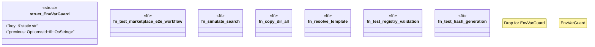

# `tests/e2e_marketplace.rs`

Source SHA-256: `6eeee4e0f8841033a4e2726f36f85ff5c02f20daf7b0020b0ba3ab934b814a6d`

## Dependencies

- `anyhow::Result`
- `serial_test::serial`
- `std::env`
- `std::fs`
- `std::path::PathBuf`
- `tempfile::TempDir`

## Standing

- Structural parse: `ALIVE`
- Runtime behavior: `UNKNOWN`
