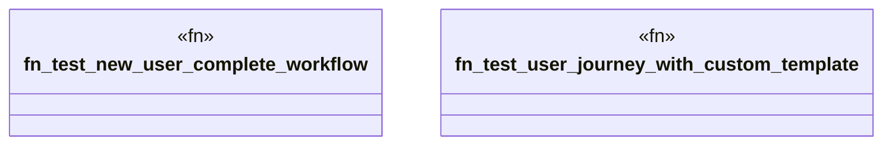

# `tests/e2e_v2/complete_user_journey.rs`

Source SHA-256: `c52044284373a55ffbcfa6831680a4bbf06fb22872a882425f55064e51b6f0b1`

## Dependencies

- `assert_cmd::Command`
- `predicates::prelude::*`
- `std::fs`
- `super::test_helpers::*`

## Standing

- Structural parse: `ALIVE`
- Runtime behavior: `UNKNOWN`
