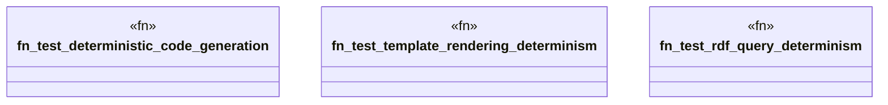

# `tests/e2e_v2/deterministic_output.rs`

Source SHA-256: `e2124fc7527579f1e95d008c7028e1668416d18fab458e936afa5558ea31205a`

## Dependencies

- `assert_cmd::Command`
- `std::fs`
- `super::test_helpers::*`

## Standing

- Structural parse: `ALIVE`
- Runtime behavior: `UNKNOWN`
