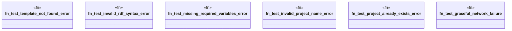

# `tests/e2e_v2/error_handling.rs`

Source SHA-256: `4a4f4940b37068201c04f1e6f5039e18c6aa2ab96e5adafee9e4d0af80812b73`

## Dependencies

- `assert_cmd::Command`
- `predicates::prelude::*`
- `std::fs`
- `super::common::integration_timeout`
- `super::test_helpers::*`

## Standing

- Structural parse: `ALIVE`
- Runtime behavior: `UNKNOWN`
