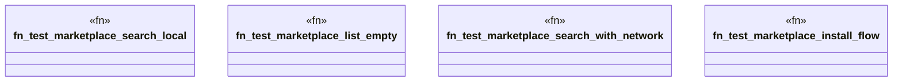

# `tests/e2e_v2/marketplace_discovery.rs`

Source SHA-256: `05e87b05bc4a76b01d76ebbabb81df6435b9b6fcc76d4dd478f042dfb39e00c4`

## Dependencies

- `assert_cmd::Command`
- `predicates::prelude::*`
- `super::common::integration_timeout`
- `super::test_helpers::*`

## Standing

- Structural parse: `ALIVE`
- Runtime behavior: `UNKNOWN`
