# `tests/e2e_v2/mod.rs`

Source SHA-256: `087d1977ccd91dbe873591299065f41b01b4537aec93448566a0c66e9fceeec8`

```mermaid
classDiagram
    class mod_complete_user_journey {
      <<mod>>
    }
    class mod_deterministic_output {
      <<mod>>
    }
    class mod_error_handling {
      <<mod>>
    }
    class mod_marketplace_discovery {
      <<mod>>
    }
    class mod_multilang_generation {
      <<mod>>
    }
    class mod_performance_validation {
      <<mod>>
    }
    class mod_rdf_query_workflow {
      <<mod>>
    }
    class mod_rdf_template_workflow {
      <<mod>>
    }
    class mod_template_versioning {
      <<mod>>
    }
    class mod_test_helpers {
      <<mod>>
    }
    class mod_common {
      <<mod>>
    }
```

## Dependencies

- None observed.

## Standing

- Structural parse: `ALIVE`
- Runtime behavior: `UNKNOWN`
