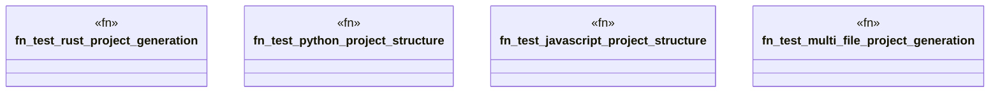

# `tests/e2e_v2/multilang_generation.rs`

Source SHA-256: `793c3088c3f22aad73f4326c6f84359c4fc36f8a01d0c1d478cddd8daeb83434`

## Dependencies

- `assert_cmd::Command`
- `std::fs`
- `super::test_helpers::*`

## Standing

- Structural parse: `ALIVE`
- Runtime behavior: `UNKNOWN`
