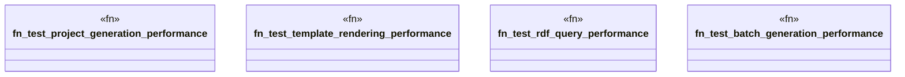

# `tests/e2e_v2/performance_validation.rs`

Source SHA-256: `627e8ac37813659bdc15bc9a622fec83bd49f447d78b2f7358298dba7d989d61`

## Dependencies

- `assert_cmd::Command`
- `std::fs`
- `std::time::Instant`
- `super::test_helpers::*`

## Standing

- Structural parse: `ALIVE`
- Runtime behavior: `UNKNOWN`
