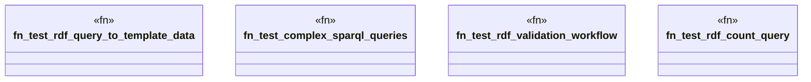

# `tests/e2e_v2/rdf_query_workflow.rs`

Source SHA-256: `5aec6a24a270ba3af724c62179be61ecd95760c5a81ba94909f2eb8e26ab4b79`

## Dependencies

- `assert_cmd::Command`
- `predicates::prelude::*`
- `std::fs`
- `super::test_helpers::*`

## Standing

- Structural parse: `ALIVE`
- Runtime behavior: `UNKNOWN`
