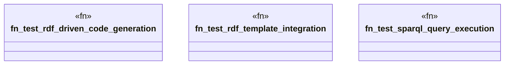

# `tests/e2e_v2/rdf_template_workflow.rs`

Source SHA-256: `7dc0865ad3eb64ecba9c2a7d0f89157b7f1085c03b70a197a432224fd152480f`

## Dependencies

- `assert_cmd::Command`
- `predicates::prelude::*`
- `std::fs`
- `super::test_helpers::*`

## Standing

- Structural parse: `ALIVE`
- Runtime behavior: `UNKNOWN`
