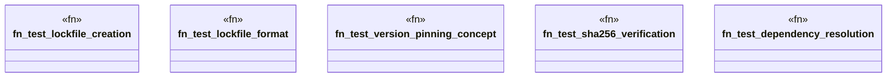

# `tests/e2e_v2/template_versioning.rs`

Source SHA-256: `635ea9784aad2989ba249f4f24db6ccdc062ed3952f9163abcffcef786abe98b`

## Dependencies

- `std::fs`
- `std::process::Command as StdCommand`
- `super::test_helpers::*`

## Standing

- Structural parse: `ALIVE`
- Runtime behavior: `UNKNOWN`
