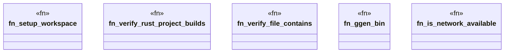

# `tests/e2e_v2/test_helpers.rs`

Source SHA-256: `67894a725a6cd5e57161575b7dc5889c799d79600d3a142538fd57fc17a89fca`

## Dependencies

- `ggen_core::utils::error::{Error, Result}`
- `std::path::{Path, PathBuf}`
- `std::process::Command as StdCommand`
- `tempfile::TempDir`

## Standing

- Structural parse: `ALIVE`
- Runtime behavior: `UNKNOWN`
