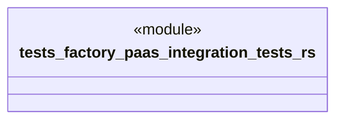

# `tests/factory_paas/integration_tests.rs`

Source SHA-256: `320e54d2b5f5c96b7aa5c51949937d2be56fc41708b76a6e43bb30e980475ef4`

## Dependencies

- `ggen_saas::factory_paas::*`
- `super::TestContext`
- `uuid::Uuid`

## Standing

- Structural parse: `ALIVE`
- Runtime behavior: `UNKNOWN`
