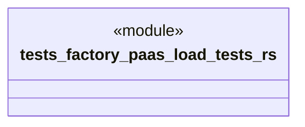

# `tests/factory_paas/load_tests.rs`

Source SHA-256: `1ce407df3715279a389c821d59ea943c507644deb6533a2b5f99f5439c8bdbdf`

## Dependencies

- `ggen_saas::factory_paas::*`
- `std::sync::Arc`
- `std::time::{Duration, Instant}`
- `super::TestContext`
- `tokio::sync::RwLock`
- `uuid::Uuid`

## Standing

- Structural parse: `ALIVE`
- Runtime behavior: `UNKNOWN`
