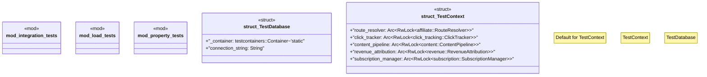

# `tests/factory_paas/mod.rs`

Source SHA-256: `c507528271b764b5286855eefbec8b4e022c09686053e0fd6c33da8c5751ee8d`

## Dependencies

- `ggen_saas::factory_paas::*`
- `std::sync::Arc`
- `testcontainers::{clients::Cli, RunnableImage}`
- `testcontainers_modules::postgres::Postgres`
- `tokio::sync::RwLock`
- `uuid::Uuid`

## Standing

- Structural parse: `ALIVE`
- Runtime behavior: `UNKNOWN`
