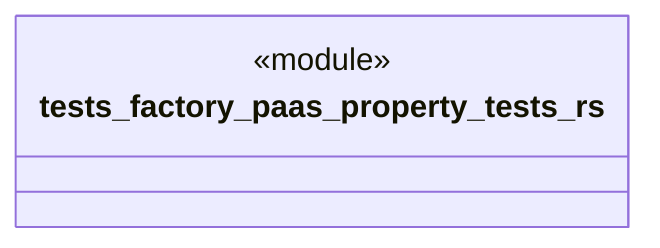

# `tests/factory_paas/property_tests.rs`

Source SHA-256: `ac98a1f1e3369e79dbaaffe1a6c255c03f2e7f628205a088ab978ae067f14e0f`

## Dependencies

- `ggen_saas::factory_paas::*`
- `proptest::prelude::*`
- `uuid::Uuid`

## Standing

- Structural parse: `ALIVE`
- Runtime behavior: `UNKNOWN`
