# `tests/fixture_validation_proof.rs`

Source SHA-256: `5f49631f3ec7bf6ce9d0545463820232879e68c28d75e7e3988d3a55e5ab2e90`

```mermaid
classDiagram
    class mod_validator {
      <<mod>>
    }
    class fn_build_sample_context {
      <<fn>>
    }
    class fn_validate_parse {
      <<fn>>
    }
    class fn_validate_render {
      <<fn>>
    }
    class fn_extract_missing_variables {
      <<fn>>
    }
    class fn_test_valid_basic_parses {
      <<fn>>
    }
    class fn_test_valid_loop_parses {
      <<fn>>
    }
    class fn_test_valid_condition_parses {
      <<fn>>
    }
    class fn_test_valid_nested_paths_parses {
      <<fn>>
    }
    class fn_test_invalid_unclosed_expression_fails {
      <<fn>>
    }
    class fn_test_invalid_unclosed_statement_fails {
      <<fn>>
    }
    class fn_test_invalid_bad_block_fails {
      <<fn>>
    }
    class fn_test_invalid_bad_expression_fails {
      <<fn>>
    }
    class fn_test_valid_basic_renders_with_context {
      <<fn>>
    }
    class fn_test_valid_loop_renders_with_context {
      <<fn>>
    }
    class fn_test_missing_context_variable_classified {
      <<fn>>
    }
    class fn_test_all_active_project_templates_parse {
      <<fn>>
    }
```

## Dependencies

- `ggen_core::validation::syntax_validator::{detect_language, validate_syntax}`
- `std::fs`
- `std::path::Path`
- `tera::{Context, Tera}`

## Standing

- Structural parse: `ALIVE`
- Runtime behavior: `UNKNOWN`
