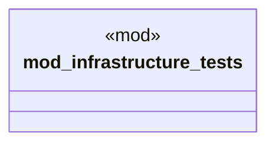

# `tests/infrastructure_validation.rs`

Source SHA-256: `97d2ea5dc3c62c1d5d467e987588739719c1fc8467966a51114d92be8ab001ba`

## Dependencies

- `std::os::unix::fs::PermissionsExt`
- `std::path::Path`

## Standing

- Structural parse: `ALIVE`
- Runtime behavior: `UNKNOWN`
