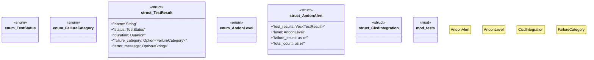

# `tests/integration/andon_alerts.rs`

Source SHA-256: `3f72aae37cba3d8f088c0bf12bc6c86e38cd1e641a3dc23f9e4901c2b8ad1780`

## Dependencies

- `std::collections::HashMap`
- `std::time::{Duration, Instant}`
- `super::*`

## Standing

- Structural parse: `ALIVE`
- Runtime behavior: `UNKNOWN`
