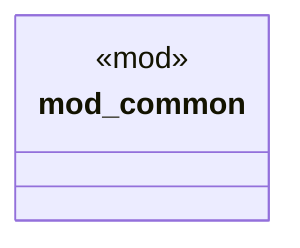

# `tests/integration/cache_tests.rs`

Source SHA-256: `bfb914bb0cb1fd6092ebbd2b3acf24c8fa7d2a4f5ea64a1ba2c47fa00140aea2`

## Dependencies

- `chicago_tdd_tools::{async_test, test}`
- `common::create_temp_dir`
- `ggen_core::{registry::ResolvedPack, CacheManager}`
- `tokio::task`

## Standing

- Structural parse: `ALIVE`
- Runtime behavior: `UNKNOWN`
