# `tests/integration/clap/ggen_toml_integration_tests.rs`

Source SHA-256: `a6b0e4fe228b6eb97c07952bd5d3f7bcebbf9baf8ef804404e5bbd4f0b260b75`

```mermaid
classDiagram
    class struct_EnvVarGuard {
      <<struct>>
      +"key: &'static str"
      +"previous: Option~std::ffi::OsString~"
    }
    class fn_ggen {
      <<fn>>
    }
    class fn_test_load_ggen_toml {
      <<fn>>
    }
    class fn_test_cli_args_override_config {
      <<fn>>
    }
    class fn_test_env_vars_override_config {
      <<fn>>
    }
    class fn_test_configuration_precedence {
      <<fn>>
    }
    class fn_test_type_validation {
      <<fn>>
    }
    class fn_test_missing_required_fields {
      <<fn>>
    }
    class fn_test_invalid_toml_error {
      <<fn>>
    }
    class fn_test_config_loading_performance {
      <<fn>>
    }
    class fn_test_large_config_file {
      <<fn>>
    }
    class fn_test_complex_config_structures {
      <<fn>>
    }
    note "Drop for EnvVarGuard"
    note "EnvVarGuard"
```

## Dependencies

- `assert_cmd::Command`
- `predicates::prelude::*`
- `serial_test::serial`
- `std::env`
- `std::fs`
- `std::time::Instant`
- `tempfile::TempDir`

## Standing

- Structural parse: `ALIVE`
- Runtime behavior: `UNKNOWN`
