# `tests/integration/clap/io_validation_tests.rs`

Source SHA-256: `d98e23dcb8e503690ffd33e620cdb91de79eecbde99128a8922a8590ba82bcbb`

```mermaid
classDiagram
    class fn_test_safe_file_paths_allowed {
      <<fn>>
    }
    class fn_test_path_traversal_detection {
      <<fn>>
    }
    class fn_test_absolute_path_validation {
      <<fn>>
    }
    class fn_test_file_permission_validation {
      <<fn>>
    }
    class fn_test_symlink_attack_prevention {
      <<fn>>
    }
    class fn_test_directory_traversal_permissions {
      <<fn>>
    }
    class fn_test_io_validation_performance {
      <<fn>>
    }
    class fn_test_writable_directory_validation {
      <<fn>>
    }
    class fn_test_nonexistent_parent_directory {
      <<fn>>
    }
```

## Dependencies

- `std::fs`
- `std::os::unix::fs::PermissionsExt`
- `std::path::PathBuf`
- `std::time::Instant`
- `tempfile::TempDir`

## Standing

- Structural parse: `ALIVE`
- Runtime behavior: `UNKNOWN`
