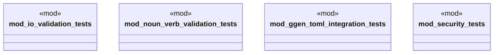

# `tests/integration/clap/mod.rs`

Source SHA-256: `717b4e6573dd0a8a46df47be1c188c5a99f173ad118577dbff66c990eb1fe8e0`

## Dependencies

- None observed.

## Standing

- Structural parse: `ALIVE`
- Runtime behavior: `UNKNOWN`
