# `tests/integration/clap/noun_verb_validation_tests.rs`

Source SHA-256: `d25bb60594570f7556b2150248e7eba31fefdddc57392dc690384ccaf3666c51`

```mermaid
classDiagram
    class fn_ggen {
      <<fn>>
    }
    class fn_test_valid_noun_verb_sequences {
      <<fn>>
    }
    class fn_test_invalid_verb_sequences {
      <<fn>>
    }
    class fn_test_noun_without_verb_shows_help {
      <<fn>>
    }
    class fn_test_invalid_noun_with_suggestion {
      <<fn>>
    }
    class fn_test_action_ordering_validation {
      <<fn>>
    }
    class fn_test_subcommand_nesting_limits {
      <<fn>>
    }
    class fn_test_no_circular_dependencies {
      <<fn>>
    }
    class fn_test_command_structure_consistency {
      <<fn>>
    }
    class fn_test_required_arguments_enforced {
      <<fn>>
    }
    class fn_test_global_flags_work {
      <<fn>>
    }
    class fn_test_command_parsing_performance {
      <<fn>>
    }
```

## Dependencies

- `assert_cmd::Command`
- `predicates::prelude::*`
- `std::time::Instant`

## Standing

- Structural parse: `ALIVE`
- Runtime behavior: `UNKNOWN`
